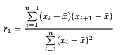

```{r setup, include=FALSE} 
knitr::opts_chunk$set(warning = FALSE, message = FALSE) 
```

# Hands on: Statistical Introduction to a low flow analysis 


## How to follow this Guide 

This guide is supposed to an interactive guide to learn the statistical approach of low flow analysis. The best way to learn how to analyze discharge measurements or other time series yourself is to follow this guide interactively by running the code yourself. The entire manual will be accompanied and based on the "R language and environment for statistical computing" [R Core Team, 2022]. It is an open source software and freely accessible (https://www.r-project.org/about.html).

The **lfanalyse** R-package was developed in the framework of this project and combines functions to analyze a discharge time series using descriptive statitics, threshold based low flow analysis and by estimating trends. For further information, please visit the package repository and find the description of the package: https://github.com/maibrittbergh/lfanalyse. 

To follow this guide it will be useful to install and library the packages:
```{r}
library(devtools)
#install_github("maibrittbergh/lfanalyse")
library(lfanalyse)
library(readr) #package is useful to read rds files.
library(patchwork)
```

If you are not sure about a specific function we will be using please check the R documentation to find a description of the function. 


### Dataset

The GRDC data set is continuously updated by the Global Runoff Data Centre (GRDC) and freely available under the following link: https://www.bafg.de/GRDC/EN/02_srvcs/21_tmsrs/210_prtl/prtl_node.html [GRDC, 2021]. It contains averaged daily or monthly discharge values for more than 10,000 stations in 159 countries [BFG, 2020]. The values unit is cubic metres per second. Please download the data in daily resolution for all the stations that you are interested in. Save the downloaded data.
The GRDC will send an email with the download link to you (normally within 24 hours).

#### Load Data into R

At first we will use the **metadata_grdc** function of the lfanalyse package to create a *metadataset* of the stations that we are interested in. Therefore you need the directory to the downloaded GRDC-data (**path**). 
Optional: if you only want to look at stations from one country of all the downloaded data, choose: **country_selection=T** and choose the country in the **Country** argument of the function:

```{r}
path= "/Users/maibrittberghofer/Desktop/Arbeit/2022-11-02_10-59"
metadata=lfanalyse::metadata_grdc(country_selection=T, Country="DE", path=path)
head(metadata)
```

The function returns a dataframe. Each row in the dataframe represents a station of interest. With this dataframe, we can now load the discharge timeseries into R. This function reads in all the locally saved GRDC datasets and stores them into a list. Each entry of the list is a different station.

```{r}
data=lfanalyse::grdc_reader(metadata, path)
```


## Section 1: The goal of the Analysis

The goal of this analysis is to detect whether one can observe a trend of observed discharge data. 

At first we will have a closer look at our data to get a general idea of the seasonality, the range and the average discharge values. 

## Section 2: Descriptive Statistics: The Variety of the Dataset

*Descriptive statistics* is the first step to many statistical analyses. It helps us to get a general idea of the dataset. How long is our time series? Maybe we want to know average values, different quantiles to be able to make a statement about low flow events? Looking at general properties of the timeseries, we might also be able to critically question our data. Maybe we can detect abrupt changes in the discharge data that could be explained by a human influence on the flow regime. Therefore a descriptive analysis is crucial for the planned trend analysis.
In this manual we will have a look at the *Moselle*-station: *Cochem*:
```{r}
summary(data$COCHEM[,2])
```


```{r}
Qplot=Qplot(data,"COCHEM")
R=Rasterplot("COCHEM",data)
bp=lfanalyse::QBoxplot(data, "COCHEM")
Qplot/R
```
##### Question 1:
What is remarkable? How would you describe the average discharge? Can you already see a seasonal variation?


```{r}

ts=timeslice(data, "COCHEM", 1950, 1970, 1970, 1990)
ts2=timeslice(data, "COCHEM",  1970, 1990, 1990, 2010)
ts/ts2

```


##### Question 2: 
What else could be helpful descriptive statistic approaches and why? 


## Section 3: Low Flow Periods

How do we define *low flow*?
Analogous to the interactive analysistool we define the low flow threshold quantile based. If 90% of all measured values are higher than a specific value, this value is the station-specific Q90-low flow threshold [Laaha und Blöschl, 2006]. 

```{r}
Q90=quantile(data$COCHEM[,2],0.1)
print(Q90)
```

The Q90-threshold of the considered timeseries is 73.2 [$\frac{m^3}{s}$]. This value  characterizes low flow events. If the measured discharge value is below the Q90-Threshold for several consecutive days, this is defined as a low flow period. This period can be described with 3 variables [Oestermann und Mudersbach, 2021]: 

- Length: Number of days on which the threshold value is not exceeded in succession.
- Deficit: Volume in m³ between threshold and the hydrograph. 
- Q90-threshold

If we look at a certain timespan we can characterize tmax and Vmax, the maximum length of a low flow period and the maximum deficit[$\frac{m^3}{s}$] in the timespan. 

```{r}
periodplot18=U_periodploty(data, "COCHEM", 73.2, 2018, graph = T)

periodplot18
```
##### Question 3: 
Look at low flow periods of different years. In which season do low flow events normally occur? What range of values can you observe for the maximal length of a low flow period?


##  Section 3: How to fit a trend?


### Which model?

Of course we are very likely to loose information by trying to summarize the entire dataset in straigh lines of different slopes. For example: It could be possible that due to an increasing number of extreme heat events since 2000 there might have also more water scarcity events since 2000. But if we only adjust a straight line from 1860 to 2000 we might loose information. Other models? This is an important and right point that leads us directly to a whole debate.


##### Question 4: 
Can you think of other models that we could fit? How would you try this in R?


#### Prediction or statistical Inference?

The overall assumption that there is any kind of relation between the discharge Value (Y) and the Time (X) we can write in a general form: 

y= f(X)+ε (3.1)

Independently of the example to analyze discharge data, f(X) is not known but fixed and ε is an error term, independetn of X and has zero as a mean. From f we learn what x can tell us about y. At this point it should be mentioned that f could be constructed of more than one input variable. In many cases estimating f is very important, like: 

1. For Prediction

One can easily think of a situation where the input (x) is available but one can't make any assumptions concerning y. Therefore we need to make a prediction $\hat{y}$ of y finding $\hat{f}$ that provides the most accuracy for y. In this case one can treat $\hat{f}$  like a **black box**. Therefor $\hat{f}$  will not be the perfect guess for our function f(x). How good our estimations of $\hat{y}$ for y are depends on the **reducible** and the **irreducible** error. The closer  $\hat{f}$ is to f the more we can reduce this **reducible** error. Nevertheless y is a function of ε (1.1) therefore it is not possible to only predict it with x (or f(x)). This gap is described as the irreducible error. 
For a prediction  one can set ε=0 as it may contain unmeasured quantities  that might hold additional information for the prediction, but as they are not measured there is no way to conlude them into our prediction. Therefore the prediction term is: 

$\hat{y}=\hat{f}(x)$ (3.2)


2. For Inference

Oftentimes we want to assess the relation between y and x ($x_1, x_2,..., x_n$). In this case it is our goal to find out what f is although we dont want to make predictions for y. 

Of course there is modeling consisting of prediction and inference at the same time as well. Depending on our goal or problem we can think of different ways to specify f. A linear model allows assumptions of statistical inference on first sight but might not always be appropriate for predictions. 


## Section 4: The Linear model


### The Error
As mentioned above (Section 3) $\hat{y}(x)$ clarifies that we speak about a prediction of y (dependent on x). It is important to keep in mind that the predictors/ parameters are unknown and need to estimated in a way that the resulting model fits the data as good as possible. **As good as possible** can also be expresses numerically by determining the error:

$e_i=y_i-\hat{y}_i$. (4.3)

To avoid the problem that negative residuals cancel out the positive residuals the **RSS: residual sum of sqaures is defined**: 

$RSS=e_1^2+e_2^2+...e_n^2$ (4.4)

By minimizing the **RSS** we obtain the best $w_0$ and $w_1$, this is described be the **Linear Least Squares Approach**:

$w_1=\frac{\sum_{i=1}^{n} (x_i-\overline{x})(y_i-\overline{y}}{\sum_{i=1}^{n} (x_i-\overline{x})^2}$ (5)

$w_0=\overline{y}-w_1\overline{x}$ (4.5)

### From the Function to a model
From our assumptions (Section 1) we were assuming that there is a relationship between x and y: $y= f(X)+ε$. Furthermore we believe that the data and therefore f(x) can be represented  by a linear function. The term "linear" refers to the linear model parameters/ coefficients. 

A linear model is constructed from a linear function: 
$y = w_0 + w_1* x$ (4.1)

To build a model from the linear function (4.1) we construct the linear model by adding noise: 

$y=w_0+w_1*x+ε$ (4.2)

In this case: 

1. $w_0, w_1$ are our cofficents/ parameters: $w_0$ is the intercept and $w_1$ the slope of our model
2. $x$ is our predictor 
3. $ε$ the error term includes everything that we can't adress with this simple equation ($ε$ is normally treated to be independent of x) and follows a certain distribution.


### The Noise

Everything that is not explained with our model? This could just be a measurement error that we can never really rule out. Also its possible that there are other variables than x that cause y to vary. Therefore looking at the noise can be very interesting to detect underlying trends and factors [Scales and Snider, 1998].

To understand noise better we will have a look at the words of Parzen’s (1960) about randomness: 

**"A random (orchance) phenomenon is an empirical phenomenon characterized by the property that its observation under a given set of circumstances does not always lead to the same observed outcomes (so that there is no deterministic regularity) but rather to different outcomes in such a way that there is statistical regularity. By this is meant that numbers exist between 0 and 1 that represent the relative frequency with which the different possible outcomes may be observed in a series of observations of independent occurrences of the phenomenon..."**

In many natural sciences our data is neither excact nor reproducible. In addition there is an infinte number of parameters in the earth system so that our models will always be approximations [Scales and Snider, 1998].

In our example, looking at discharge data,it's probably not necessary to mention that precipitation, temperature, ground water storage.. as well have an influence on our variable. Although it might seam obvious it is important to be mentioned as these variables partly explain uncertainties in our approach and results. 

Even if we would be able to model every measurable influencing variable exactly our model would necessarily gain in significance. With a large number of degrees of freedom one can fit nay data - but is it worth fitting?[Scales and Snider, 1998].

After Dobrin and Savit (1988) "noise that part of the data that we choose not to explain".

As we are not able to reproduce exactly this outcome we might as well reduce the random noise by averaging [Scales and Snider, 1998].

The noise follows a certain distribution which could be gaussian, laplace, Student's t...

In our analysis we assumed the noise to be gaussian distributed. This means that our predicted value for any value of x is:

$\hat{y_i}=µ_i= w_0 + w_1* x$ (5.1)

Assuming a gaussian normal distribution for the noise, we say that the data values are normaly distributed around the mean $\hat{µ}$ [Kruschke, 2014]. Our linear least squares regression line gives the mean of these distributions at any point. 


### How many Predictors?
We distinguish between Univariate models (with just a single predictor) and Multivariate models with more than one predictor. As soon as we have multiple predictors it is more complicated to interpretate the coefficients as they are dependent on the other variables in the model [Gelman, 2006]. 

In our analysis we will only look at a univariate model as our data   [GRDC, 2021] simply consits of daily discharge measurements: 

## Linear Models in R: Least Squares or Sen's Sloap?

##### Question 4:
In the context of this data analysis, what is the dependent variable and what is the independent variable?

### Least Squares

We choose a linear function as a model, in R using `stats` and assume that y is linearly dependent on x: 

\[
  y(x)_i=b*x_i+a+ \epsilon_i           
\]

The error variable $\epsilon_i$ describes the random errors. Visually, $\epsilon$ describes the distance of the measurement points to the straight line. One fits the model to the straight line by minimising the square of these errors [Frost, 2018]. However, for the linear model to be valid, some basic assumptions must be made. Accordingly, the variance must be constant, i.e. there must be no pattern in the residuals, and the residuals must be normally distributed and independent. A major problem in the analysis of hydrological or climatic time series is that the data must be subject to an order in order to be interpretable. This means that the values are correlated with each other, i.e. the residuals are not independent. This so-called autocorrelation indicates how strongly the values influence each other as a function of time [Huxol and Leibundgut,2018].


These observations show that the validity of the model calculated by linear regression is limited, which is why a second approach was chosen in this analysis.


### Sen's Sloap

The trend determination used in this work with the R package "'zyp"' using the "'Yuepilon"' method  is done in four steps:


1. Determination and removal of the trend (Sen's Slope Estimator).
2. Determination and removal of the autocorrelation
3. Adding the trend 
4. Determination of significance: Mann-Kendall test


The approach uses the Mann-Kendall test to test the given series of measurements for a monotonic linear trend. The null hypothesis H$_0$ of the test is that there is no trend. In contrast, the alternative hypothesis H$_A$ is that there is a trend. The significance value provides a statement about how likely it is that the null hypothesis H$_0$ is true, given the available data. The concept of significance testing is to take the data as evidence. By convention, the significance level $\alpha$=0.05 is assumed in this paper, thus the null hypothesis H$_0$ is rejected from a p-value $\leq$ 0.05 onwards. For each p-value $\leq$ $\alpha$, the present trend in this analysis is called significant. 


Since it is a non-parametric test, no particular distribution of the data is assumed [Goswami, 2018]. This test is a common approach to evaluate hydrological or climatic time series, which is why it is used in a comparable context in many other papers (see:Oestermann und Mudersbach, 2021, Burns et al., 2007, Brisan et al.,2005). 
Although the Mann-Kendall test leads to biased results for shorter time series, it can be reasonably applied given the size of the measurement series at hand. Moreover, it is not suitable for data sets with strong periodicities [Goswami, 2018]. Furthermore, the test should not be applied to autocorrelated data because otherwise the rejection rate of the null hypothesis is increased while the significance level (5\%) remains the same [Bayazit and Önöz, 2007]. This error is the error of the first kind. According to Yue et al. (2002), a negative autocorrelation also leads to an influence on the trend. It leads to an increased error of the second kind, i.e. the probability of underestimating a trend, which is why significant trends are not recognised.

However individual values of time series are often autocorrelated. For this reason, the null hypothesis for these data is not necessarily rejected because of a trend. The rejection can also be due to the autocorrelation of the data [Bürger, 2017]. One way to avoid the increased rejection rate of the null hypothesis is to apply the test exclusively to data that were made independent of each other. One possible approach to this is ''prewhitening'', which corrects for autocorrelation [Kulkarni and von Storch, 1995].
Since the data must be uncorrelated for both linear regression and the Mann-Kendall test, prewhitening is applicable to both methods. For prewhitening, the basic assumption must be given that the visible trend of the time series at hand is the sum of a prevailing trend and noise generated by autocorrelation  [Zhang and Zwies, 2004].
\newline
To determine the autocorrelation, one checks the dependence of a value on the value of the time step before it. The time interval between each value is a $"$lag$"$. Lag-1, the 1st degree autocorrelation AR(1), describes the dependence of the value on the previous value [Huxol and Leibundgut, 2007].

Since prewhitening, in addition to removing autocorrelation, also leads to a reduction in the slope of the trend [Bayazit and Önöz, 2007, Yue et al., 2002], Yue et al. (2002) developed the trend-free prewhitening procedure (TFPW) approach, which was also used in this analysis.
\newline
Here, the trend is first determined according to the Theil-Sen estimate [sen, 1968]. If it is close to zero, no trend analysis is carried out. Otherwise, the trend is assumed to be linear and eliminated from the time series . Sen's trend determination is based on the use of the median, which is why Sen's slope trend is more robust to outliers in the data series than linear regression. Because of the extreme events that occur in hydrological time series, a robust approach is useful for this data set. In the Sen's slope approach, the slope is determined for every possible pair of values in the time series. The estimator of the trend of the entire time series is the median of the slopes of the individual value pairs[Huxol and Leibundgut, 2007].
Based on the revised time series, the first-order autocorrelation coefficient is then calculated, which is used to perform the prewhitening 


Based on samples, it became apparent that strong autocorrelations of the first degree occur in climatological and hydrological data sets in the first place [Huxol and Leibundgut, 2007]. The trend and the residuals are compiled in the next step in order to be able to assess the significance of the trend with the help of the Mann-Kendall test. The values used in the calculation of significance are replenished in the zyp package approach by dividing by (1-AR(1)), which yields empirically better results compared to the original method of Yue and Pilon 

#### Example: NMxQ Trend

The low flow value NM$_{x}$Q [$\frac{m^3}{s}$] describes the lowest arithmetic mean of x consecutive days within a specified time interval (ZA). This quantity is primarily suitable for estimating withdrawals and discharges, whereby the influence of short-term changes increases with decreasing values for x. The higher x is chosen, the higher the influence of the mean water  [Maniak, 2016]. 

```{r}
NM7Q=lfanalyse::NMxQ_trend(data, "COCHEM", 7)
NM7Q
```

#### Question 5: 

Try different numbers for x. How do the results differ? 

#### Question 6: 
Hands on: try other functions to determine trends, like `MQ_trend` or `Qmin_trend`. Interprate the results. If you need help, try the R Documentation. 

#### Question 7:
When is a trend significant? 

#### Question 8: 
What do you think: When are the differences between the results (Sen's Sloap Trend/linear regression) highest?


### Discussion: Sen's Sloap or linear regression?


In this tutorial, both approaches were used to allow a direct comparison. Due to a lower variance, the Sen's Slope approach yields better results for non-normally distributed datasets [Huxol and Leibundgut, 2007]. In addition, the approach is more robust to outliers.
For normally distributed data, least squares estimation may give slightly better results [Huxol and Leibundgut, 2007]. However, because of the autocorrelation and the partial pattern of the residuals, the validity of the linear model is limited, since the autocorrelation was not removed by prewhitening before calculating the linear model. 

The choice of prewhitening affects both the statistical significance and the value of the slope, which is why this approach is further investigated [Yue and Wang, 2002] and is controversial today 
The answer to the question of whether there is a sufficient trend is very prone to error, as it is often not recognisable for laypersons whether an observable trend is merely due to noise  [Zhang and Zwies, 2004]
 Since TFPW approaches are more likely to produce significant results compared to other methods, the results of these approaches should be questioned and only used with an adjustment to the significance level. The default option of the `zyp` package  uses a variance-inflation which is substantially different from the original Yue et al. 2002 approach and is also used for this analysis.  In a significance test, care should be taken to ensure that the first kind error corresponds to the significance level. Using a Monte Carlo approach, it could be shown that high type I error rates occur in TFPW approaches with increasing autocorrelation [Bürger, 2017].


## Sources: 

[Bayazit and Önöz, 2007] Bayazit, M., & Önöz, B. J. H. S. J. (2007). To prewhiten or not to prewhiten in trend analysis?. Hydrological Sciences Journal, 52(4), 611-624.

[Birsan et al., 2005] Birsan, M.-V., Molnar, P., Burlando, P., and Pfaundler, M. (2005). Streamflow trends in Switzerland. Journal of hydrology, 314(1-4):312–329

[Burns et al., 2007] Burns, D. A., Klaus, J., and McHale, M. R. (2007). Recent climate trends and implications for water resources in the Catskill Mountain region, New York, USA. Journal of Hydrology, 336(1-2):155–170.

[Bürger, 2017] Bürger, G. (2017). On trend detection. Hydrological Processes, 31(22):4039–4042. 

[Frost, 2018] Frost, I., & Frost, I. (2018). Einfache lineare Regression (pp. 3-8). Springer Fachmedien Wiesbaden.

[Gelman, 2006] Gelman, A., & Hill, J. (2006). Data analysis using regression and multilevel/hierarchical models. Cambridge university press.

[Goswami, 2018] Goswami, B. (2018). Mann–Kendall test. Last accessed 2022-02-20.

[GRDC, 2023] GRDC (2023). GRDC data download. Last accessed 2023-06-12.

[Huxol und Leibundgut, 2007] Huxol, S., & Leibundgut, C. Institut für Hydrologie der Albert-Ludwigs-Universität Freiburg i. Br.

[Kruschke, 2014] Kruschke, J. (2014). Doing Bayesian data analysis: A tutorial with R, JAGS, and Stan.

[Kulkarni and von Storch, 1995] Kulkarni, A., & von Storch, H. (1995). Monte Carlo experiments on the effect of serial correlation on the Mann-Kendall test of trend. Meteorologische Zeitschrift, 4(2), 82-85.

[Laaha und Blöschl, 2006] Laaha, G., & Blöschl, G. (2006). A comparison of low flow regionalisation methods—catchment grouping. Journal of Hydrology, 323(1-4), 193-214.

[Maniak, 2016] Maniak, U., & Maniak, U. (2016). Einführung Hydrologie und Wasserwirtschaft. Hydrologie und Wasserwirtschaft: Eine Einführung für Ingenieure, 1-19.

[Oestermann und Mudersbach, 2021] Oestermann, F., & Mudersbach, C. (2021). Langjährige Trends der Niedrigwasserkennwerte in Deutschland. Hydrologie und Wasserbewirtschaftung, 65, 137-155.

[R Core Team, 2022] R Core Team (2022). R: A language and environment for statistical computing. R Foundation for Statistical Computing, Vienna, Austria.  URL https://www.R-project.org/.

[Scales and Snider, 1998] Scales, J. A., & Snieder, R. (1998). What is noise?. Geophysics, 63(4), 1122-1124.

[Sen, 1968] Sen, P. K. (1968). Estimates of the regression coefficient based on Kendall’s tau. Journal
of the American statistical association, 63(324):1379–1389

[Yue and Wang, 2002] Yue, S., & Wang, C. Y. (2002). Applicability of prewhitening to eliminate the influence of serial correlation on the Mann‐Kendall test. Water resources research, 38(6), 4-1.

[Yue et al., 2002] Yue, S., Pilon, P., and Cavadias, G. (2002). Power of the Mann–Kendall and Spear-
man’s rho tests for detecting monotonic trends in hydrological series. Journal of hydrology, 259(1-
4):254–271.

 [Zhang and Zwiers, 2004] Zhang, X. and Zwiers, F. W. (2004). Comment on “applicability of prewhi-
tening to eliminate the influence of serial correlation on the mann-kendall test” by Sheng Yue and
Chun Yuan Wang. Water Resour. Res., 40, W03805.


